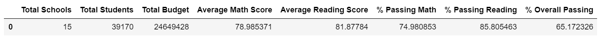
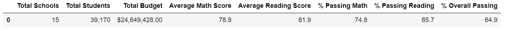
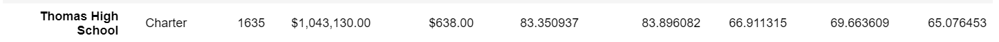
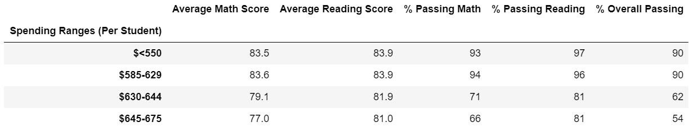
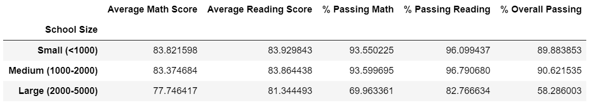
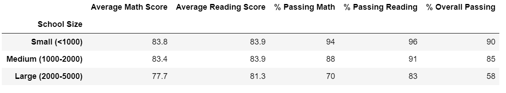
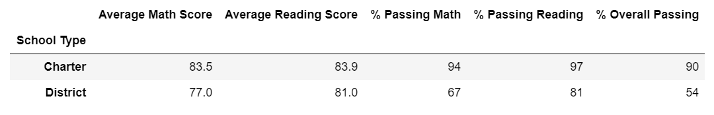
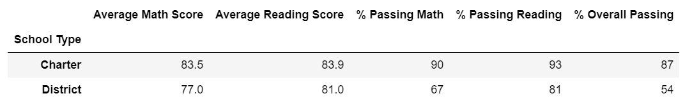

# School_District_Analysis

## Purpose
The purpose of this project was to analyze data on school funding and student's standardized test scores. The objective was to aggregate the data and demonstrate trends school performance. Results would assist the school board in making decisions regarding school budgets and funding priorities.
 
 
For the challenge, reading and math grades for Thomas High School ninth graders were removed due to suspicion of academic dishonesty. The data was then reanalyzed to determine trends and performance.

## Resources
- Data Sources: [schools_complete.csv](Resources/schools_complete.csv); [students_complete.csv](Resources/students_complete.csv)
- Software: Jupyter Notebook

## Results
- School Analysis: [PyCity Schools_Challenge](PyCitySchools_Challenge.ipynb); [PyCity_Schools](PyCitySchools.ipynb)

### How is the district summary affected?
District Summary Before Removing Ninth Grade Scores
 
 

District Summary After Removing Ninth Grade Scores
 
 

- By removing the ninth grade reading and math scores, the total number of students in the district was decreased from 39,170 to 38,709 students.
- The average math and reading scores, and the percentage of passing math and reading values were not affected by removing 9th grade test scores.
- The overall passing percentage for the district was not affected, remaining at 65% after removing 9th grader scores at Thomas High School.

### How is the school summary affected?
Thomas High School After Removing Ninth Grade Scores
 
 

- With removal of ninth grades scores, the passing math percentage for the Thomas High School decreased from 93.2% to 66.9%.
- Average reading scores were not affected, remaining at 83.8% after removing ninth grade test scores.
- For Thomas High School, the overall passing percentage decreased from 90.9% to 65%.
- The total school budget was not affected, at $1,043,130.

### How does replacing the ninth graders’ math and reading scores affect Thomas High School’s performance relative to the other schools?
Replacing the ninth grade scores caused Thomas High School's performance to decrease relative to other schools. Its rank changed from the top 5 schools to being ranked in the middle.

### How does replacing the ninth-grade scores affect the following:
- Math and reading scores by grade
  - Reading scores decreased for majority of the schools' ninth graders.
  - Math scores do not seem to have been affected.

- Scores by school spending
  - For spending range $585-629, the average math score, percentage Passing Reading, and percentage Overall Passing decreased. Percentage Passing Math increased.
  - For spending range $645-675, all values remained the same.
   
Spending Before Removing Ninth Grade Scores
   
   
 
Spending After Removing Ninth Grade Scores
  
  
 
  
- Scores by school size
  - For small (<1000) sized schools, percentage Passing Math,	percentage Passing Reading, and percentage Overall Passing values decreased.
  - Medium (1000-2000) and Large (2000-5000) schools were unaffected.
   
School Size Before Removing Ninth Grade Scores
   
  
School Size After Removing Ninth Grade Scores
   
   
  
   
- Scores by school type
  - For Charter schools, percentage Passing Math, percentage Passing Reading, and percentage Overall Passing scores increased after removing ninth grade scores. Average math and average reading scores were not affected.
  - For District schools, no values were affected, as Thomas High School is a Charter school.
 
 
 
## Summary
- Major changes in the updated school district analysis after reading and math scores for the ninth grade at Thomas High School were replaced with NaNs include:
  - Decrease in total student count from 39,170 to 38,709 students.
  - The passing math percentage for the Thomas High School decreased from 93.2% to 66.9%.
  - For Thomas High School, the overall passing percentage decreased from 90.9% to 65%.
  - For Charter schools, percentage Passing Math, percentage Passing Reading, and percentage Overall Passing scores increased after removing ninth grade scores.
